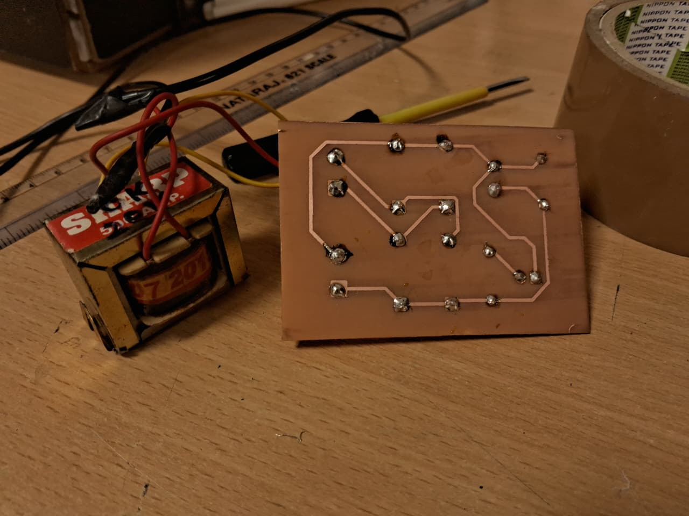
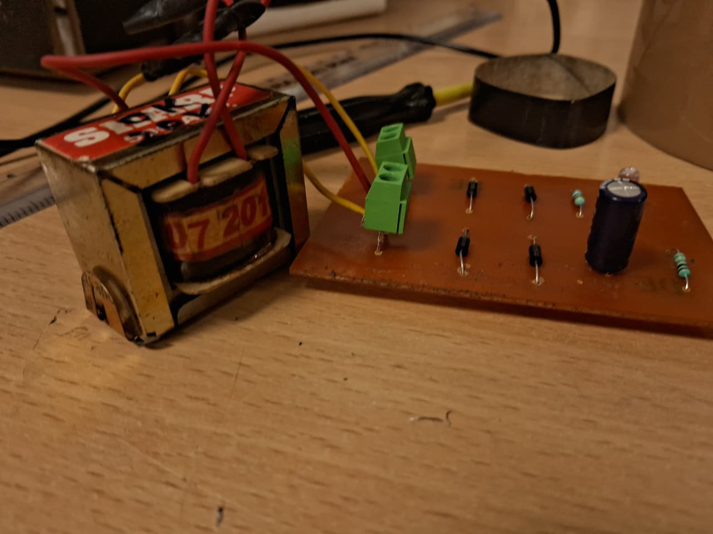
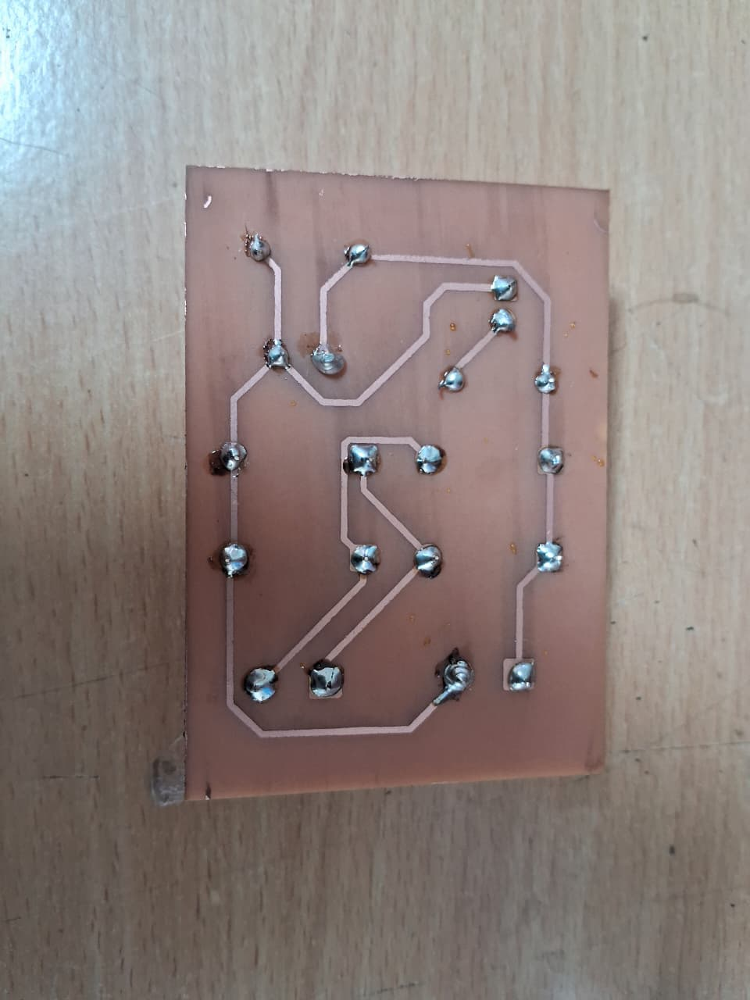
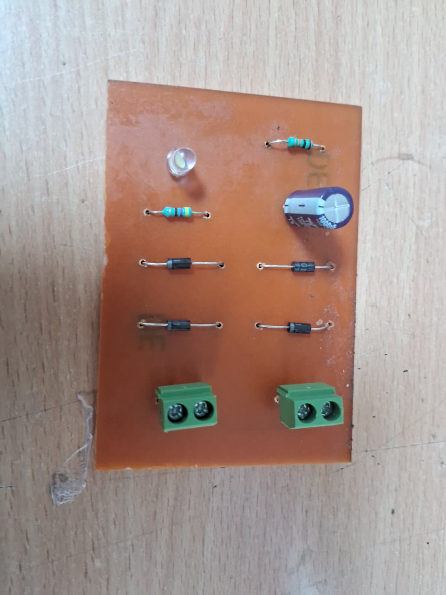

# Full Wave Bridge Rectifier PCB

## Overview
Designed and fabricated a Full Wave Bridge Rectifier PCB using KiCad.  
The circuit converts AC input into stable DC output using a diode bridge and filtering capacitor.

## Features
- Full wave AC to DC conversion
- Bridge rectifier using diodes
- Smoothing capacitor for ripple reduction
- LED power indicator

## Tools & Technologies
- KiCad (Schematic + PCB Design)
- PCB fabrication using etching method
- Soldering and hardware testing

## Learning Outcome
- PCB design workflow in KiCad
- Practical understanding of rectification
- Hands-on experience in circuit fabrication and testing
- Basics of power electronics implementation
## Project Images

### Final PCB

### Second PCB Image

### Soldering Process

### Etching Process

### Printed Layout / Setup
 

## Result
Successfully converted 12V AC input into stable DC output suitable for low-power electronic circuits.
